# PQS ANGUALR MATERIAL EXTRAS

Collection of components that adds extra functionality to [angular material](https://material.angular.io)

## Installation

```bash
npm i @pqsdev/ngx-mat-extras
```

## Coding

```bash
## clone this repo
git clone https://github.com/pqsdev/pqs-mat-extras.git
cd ./pqs-mat-extras
## install dependencies
npm i
## vscode debug is configured also
ng serve #louches the example proyect
```

## ODATA - DATASOURCE

Implementation of [CDK's DataSource](https://material.angular.io/cdk/collections/api#DataSource) that can work with ODATA version 4. It supports sorting with `mat-sort` and pagination with `mat-paginator` as well as per column filtering. Based on [Marcin Suty's odata-data-source](https://github.com/relair/odata-data-source)

## MAT-SELECT-FILTER

Child component of [angular material select ](https://material.angular.io/components/select) that allows to filter from a data source.



### MatSelectFilterDataSource

Abstract data data source for `mat-select-filter`. Implement it for custom data source

| Property               | Description                                                          | Type                          | Default     |
| ---------------------- | -------------------------------------------------------------------- | ----------------------------- | ----------- |
| `txtFilter`            | Gets/sets the text filter value                                      | `string`                      | `''`        |
| `idFilter`             | Gets/ sets the id text filter value (used to the `selectedValue`)    | `any`                         | `undefined` |
| `dataSubject`          | Emits value every time the filtered data changes                     | `BehaviorSubject<T[]>`        | `[]`        |
| `loading`              | Emits `true` when loading `false` when finished or error             | `Observable<boolean>`         |             |
| `errors`               | Emits value if there is an error                                     | `Observable<any>`             |             |
| `selectedValueChanged` | Emits a value with the object associated with the selected key value | `Observable< T \| undefined>` |             |

`setSelectedData`abstract method must be overrides in the implementations. The main goals is to emmit a value with `selectedDataSubject$`

#### Selected Key != Selected Value

Selected Key is a primitive value of the key property  (`string`, `number`, etc.) . The selected Value is the object which complies with the following `object[<<key-porperty>>] == keyValue`, in most cases.

Example SelectedKey = 32 Selected value = `{ProductID: 32, ProductName: 'Noodles' }`

### MatSelectFilterODataSource

Abstract ODATA data source for `mat-select-filter` . Implement it for custom filtering.

### MatSelectFilterFastODataSource

Simple implementation of `MatSelectFilterODataSource`.

Constructor

| Parameter        | Description                                                          | Type     | Default |
| ---------------- | -------------------------------------------------------------------- | -------- | ------- |
| `filterProperty` | The data source will filter the input text with this property.  (**) | `string` |         |
| `keyProperty`    | Used to set the value of the control.                                | `string` |         |

(**)**NESTED OBJECTS PROPERTIES ARE NOT SUPPORTED**

### MatSelectFilterObservableDataSource

implementation of `MatSelectFilterDataSource` that's allows a `Observable` data source.

Constructor

| Parameter        | Description                                                          | Type                     | Default |
| ---------------- | -------------------------------------------------------------------- | ------------------------ | ------- |
| `source`         | Observable source                                                    | `Observable<T[]> \| T[]` |         |
| `filterProperty` | The data source will filter the input text with this property. (***) | `string`                 |         |
| `keyProperty`    | Used to set the value of the control.                                | `string`                 |         |

 (***)Nested properties are allowed see https://lodash.com/docs/4.17.15#get

## MAT-SELECT INTINITE SCROLL

Adds missing infinite scroll functionality for the [angular material select component](https://material.angular.io/components/select).

Based on [HaidarZ/ng-mat-select-infinite-scroll](https://github.com/HaidarZ/ng-mat-select-infinite-scroll)

### Inputs

| Property       | Description                                                                                                                                                                                                                                                                                                              | Type      | Default |
| -------------- | ------------------------------------------------------------------------------------------------------------------------------------------------------------------------------------------------------------------------------------------------------------------------------------------------------------------------ | --------- | ------- |
| `complete`     | If `true`, the `infiniteScroll` output will no longer be triggered                                                                                                                                                                                                                                                       | `boolean` | `false` |
| `threshold`    | The threshold distance from the bottom of the options list to call the `infiniteScroll` output event when scrolled. The threshold value can be either in percent, or in pixels. For example, use the value of `10%` for the `infiniteScroll` output event to get called when the user has needs 10% to reach the bottom. | `string`  | `'15%'` |
| `debounceTime` | The threshold time before firing the `infiniteScroll` event                                                                                                                                                                                                                                                              | `number`  | `150`   |

### Outputs

| Property         | Description                                                                     | Type                 |
| ---------------- | ------------------------------------------------------------------------------- | -------------------- |
| `infiniteScroll` | Emitted when the scroller inside the `mat-select` reaches the required distance | `EventEmitter<void>` |
